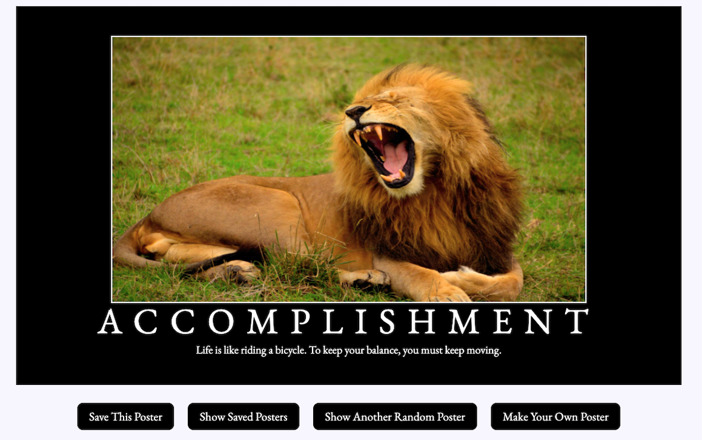
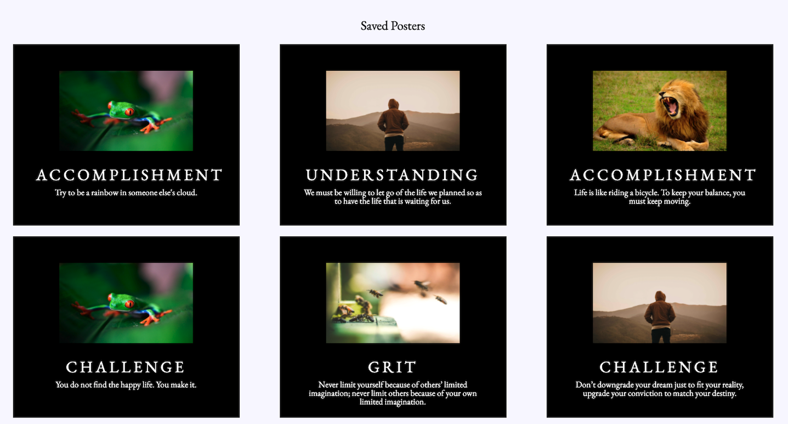
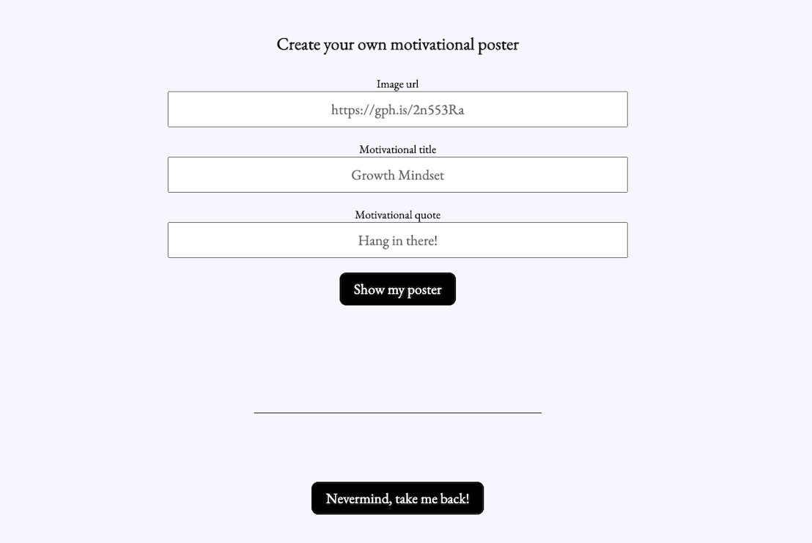

# Hang In There Boilerplate Generator

A boilerplate production repo written in Javascript. Do you like to feel motivated when you're down? Hang In There generates random motivational posters to pick you up when you're feeling blue. Have an idea for a motivational poster and you just need to create it? Use the Make My Poster feature to get started.








## Instructions for Running Project

1. Go to
```
https://github.com/caragon4695/hang-in-there-boilerplate
```
2. Fork this repository
3. Go to settings and turn on GitHub Pages for this repository
4. Clone down this repository
5. `cd` into the repository in your terminal
6. Run `open index.html` to view it in the browser

## Technologies Used

* GitHub
* Atom
* Google

## Contributors

1. Cameron Aragon
2. Anneke Miers

## Future Additions

Would you like to improve the Hang In There Boilerplate Generator? Please create a pull request.
